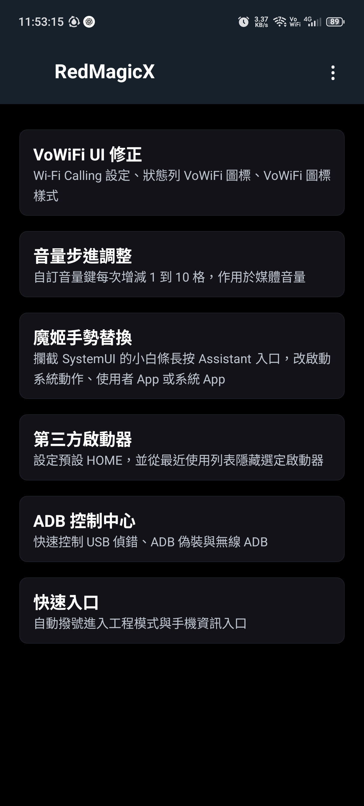
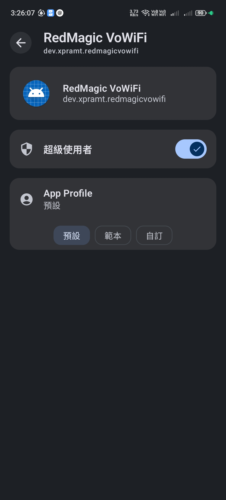
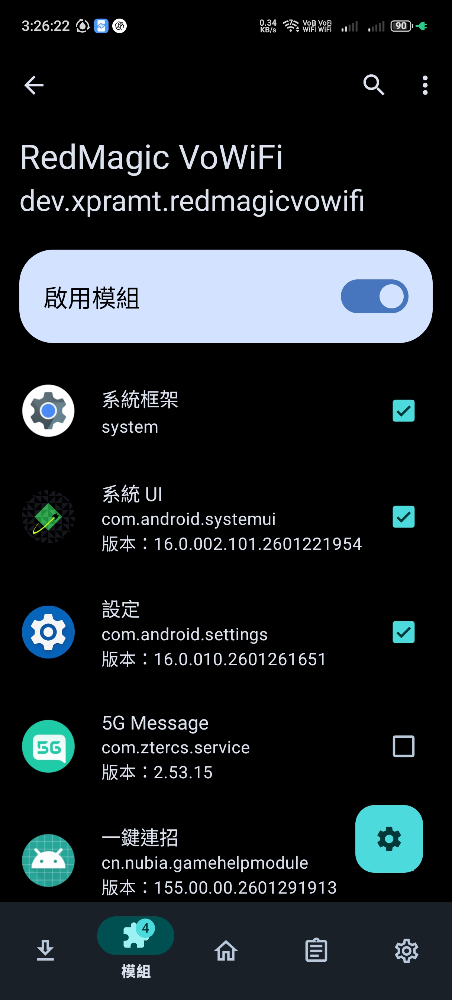
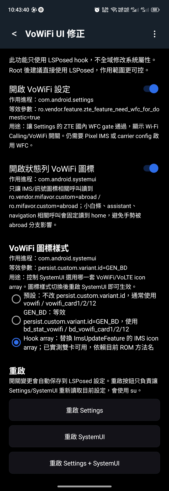
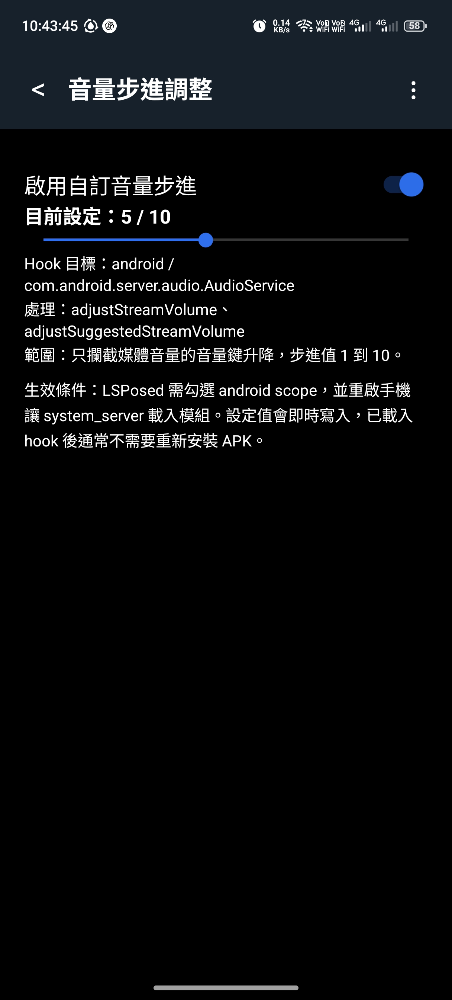
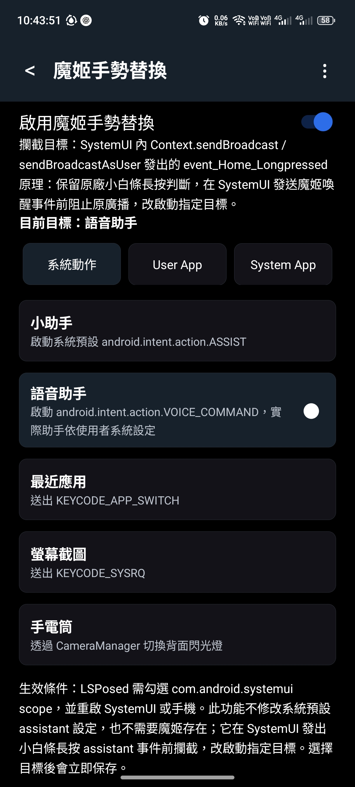
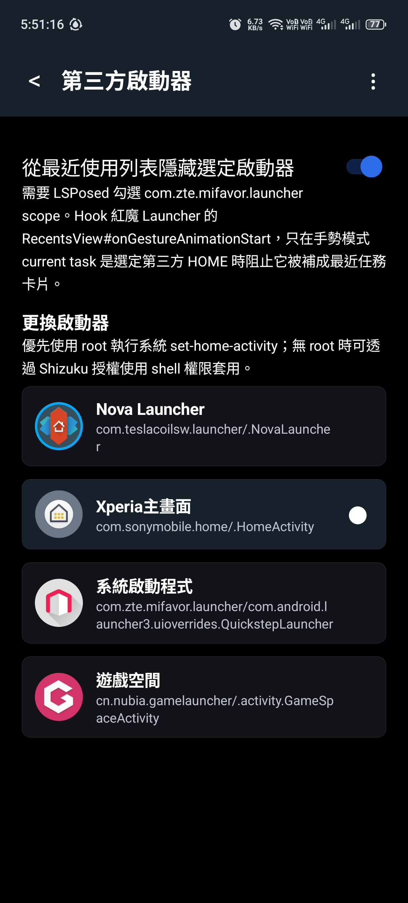

# RedMagicX

語言：[English](README.md) | 繁體中文

RedMagicX 是非官方 RedMagic / Nubia 系統調整工具，支援 LSPosed、root、Shizuku 使用情境。主要改進或解決中國版 ROM UI 行為：VoWiFi UI、媒體音量鍵步進、小白條助手手勢替換、第三方啟動器控制、ADB 控制，以及工程模式與手機資訊快速入口。

目前版本：`0.3.1`

測試裝置：RedMagic / Nubia NX809J 中國版 ROM。其它 RedMagic / Nubia 機型尚未測試，但若 ROM 使用相同 ZTE 類別與屬性，理論上可能可用。



## 目錄

- [安裝](#安裝)
- [LSPosed 作用域](#lsposed-作用域)
- [功能](#功能)
  - [VoWiFi UI 修正](#vowifi-ui-修正)
  - [音量步進調整](#音量步進調整)
  - [魔姬手勢替換](#魔姬手勢替換)
  - [第三方啟動器](#第三方啟動器)
  - [ADB 控制中心](#adb-控制中心)
  - [快速入口](#快速入口)
- [編譯](#編譯)
- [注意事項](#注意事項)

## 安裝

從 [GitHub Releases](https://github.com/XPRAMT/RedMagicX/releases) 下載 APK 後，直接在手機上安裝即可。

VoWiFi 電信商能力本身仍需要 [Pixel IMS](https://github.com/kyujin-cho/pixel-volte-patch) 或等效 carrier-config 修改。請先安裝 Pixel IMS 並用它開啟 VoWiFi。RedMagicX 主要修正中國版 ROM 的 UI 行為：設定頁缺少 Wi-Fi Calling / VoWiFi 開關，以及狀態列 VoWiFi 圖標顯示問題。

Root 只用於需要執行 shell 指令的動作，例如重啟 Settings/SystemUI，以及未使用 Shizuku 時套用預設啟動器。



在 LSPosed 內選擇 RedMagicX 作用域：



## LSPosed 作用域

在 LSPosed 啟用 RedMagicX，並依照使用功能勾選作用域：

| 功能           | 需要作用域                                         |
| ------------ | --------------------------------------------- |
| VoWiFi UI 修正 | `com.android.settings`、`com.android.systemui` |
| 音量步進調整       | `android` / System Framework                  |
| 魔姬手勢替換       | `com.android.systemui`                        |
| 第三方啟動器最近任務隱藏 | `com.zte.mifavor.launcher`                    |

設定透過 LSPosed `XSharedPreferences` 保存。若目標進程在修改設定前已經載入，請使用 App 內提供的重啟按鈕重啟相關進程；若目標是 `android`，則需要重啟手機。

## 功能

### VoWiFi UI 修正

只使用 LSPosed hook，不透過 `resetprop` 全域修改系統屬性。



| 開關                       | 作用域                    | 修改內容                                                                                                                                            |
| ------------------------ | ---------------------- | ----------------------------------------------------------------------------------------------------------------------------------------------- |
| 開啟 VoWiFi 設定             | `com.android.settings` | 讓 Settings 讀到 `ro.vendor.feature.zte_feature_need_wfc_for_domestic=true`，顯示 Wi-Fi Calling / VoWiFi 開關。仍需要 Pixel IMS 或 carrier config 啟用 WFC 能力。 |
| 開啟狀態列 VoWiFi 圖標          | `com.android.systemui` | 只讓 IMS/狀態列圖標相關程式碼讀到 `ro.vendor.mifavor.custom=abroad` / `ro.mifavor.custom=abroad`，navigation/assistant 相關程式碼維持 `home`，避免小白條手勢失效。               |
| VoWiFi 圖標樣式 = GEN_BD     | `com.android.systemui` | 讓 SystemUI 讀到 `persist.custom.variant.id=GEN_BD`，使用 BD 樣式 VoWiFi 資源。切換後重啟 SystemUI 生效。                                                          |
| VoWiFi 圖標樣式 = Hook array | `com.android.systemui` | 把 IMS icon array 回傳結果替換成 BD array。目前 NX809J ROM 已實測雙卡可用，但依賴目前 ROM 方法名。                                                                          |

「打開 WiFi 通話設定」按鈕可直接開啟紅魔設定的 `WifiCallingSettingsActivity`，不需要 root 或 Shizuku。

VoWiFi 圖標樣式對照：

預設樣式使用 `statusbar_vowifi.svg`：


BD 樣式使用 `bd_stat_vowifi.svg`：


### 音量步進調整

自訂按一次實體音量鍵時，媒體音量增減的格數。



- 範圍：`1` 到 `10`
- 作用域：`android` / System Framework
- Hook 目標：`com.android.server.audio.AudioService`
- 修改行為：媒體音量鍵升降步進
- 生效方式：開啟功能並設定步進值後，重啟手機讓 system_server 載入 LSPosed 模組

### 魔姬手勢替換

攔截 RedMagic 底部小白條長按 assistant 事件，改啟動指定目標。



可選目標：

- 系統動作：小助手、語音助手、最近應用、螢幕截圖、手電筒
- 使用者 App
- 系統 App

此功能不修改 Android 系統預設 assistant 設定，而是在 SystemUI 開啟原本紅魔助手目標前攔截，改啟動選定目標。

### 第三方啟動器

將選定啟動器設為預設 HOME，並可在手勢模式下從紅魔最近使用列表隱藏該啟動器。



- 更換啟動器：使用 Android 內建 `cmd package set-home-activity --user 0 <component>`。
- 權限方式：優先使用 root；無 root 時可透過 Shizuku shell 權限套用。
- 隱藏最近任務：需要 LSPosed 勾選 `com.zte.mifavor.launcher` scope。Hook 紅魔 Launcher 的 `RecentsView#onGestureAnimationStart`，只在手勢模式 current task 是選定第三方 HOME 時阻止它被補成最近任務卡片。

### ADB 控制中心

ADB 控制中心的所有動作都需要 root 權限。

- 啟用 ADB：透過 `adb_enabled=1` 控制開發人員選項的 USB 偵錯。
- 偽裝 ADB 狀態：寫入 `adb_enabled=2`。Android 將大於零的值視為已啟用；只會影響精確檢查 `adb_enabled == 1` 的部分 App，無法繞過檢查其它偵錯狀態的 App。
- 啟用無線 ADB：設定 TCP 連接埠並重啟 `adbd`。開關保存的是使用者意圖，不會隨 daemon 實際狀態自動關閉。ADB 已開啟時，RedMagicX 每五秒檢查一次；若無線 ADB 未執行，會以已保存的連接埠自動恢復。
- 允許 ADB 安裝：控制紅魔開發人員選項的 `adb_install_enabled=1`，開啟後才可透過 `adb install` 安裝 APK。

### 快速入口

自動撥號進入紅魔工程模式，並提供手機資訊入口。

- 解鎖工程模式：透過紅魔原廠撥號盤自動輸入 `*983*673636#`，通常只需執行一次。
- 進入工程模式：自動輸入 `*983*0#`，讓 EMode 完成必要初始化並載入完整測試選單。
- 撥號盤檢查：注入輸入前會確認 `com.android.contacts/.activities.DialtactsActivity` 存在且已啟用；找不到或啟動失敗時立即停止，不會誤報成功。
- 權限方式：優先使用 root；無 root 時可透過 Shizuku shell 權限操作。
- 手機資訊：在已測試的 NX809J ROM 可直接開啟 `com.android.phone/.settings.RadioInfo`，不需要 root 或 Shizuku。

## 編譯

```powershell
& 'C:\Users\XPRAMT\.gradle\wrapper\dists\gradle-8.13-bin\5xuhj0ry160q40clulazy9h7d\gradle-8.13\bin\gradle.bat' -p 'D:\Android\ZTE\VoWiFI\lsposed-redmagic-vowifi' assembleDebug
```

APK 輸出位置：

```text
app\build\outputs\apk\debug\app-debug.apk
```

## 注意事項

- 模組宣告 `xposedminversion=93` 與 `xposedsharedprefs=true`。
- Shizuku 用於無 root 時套用預設啟動器，以及操作工程模式快速入口。
- 本專案為非官方工具，與 RedMagic、Nubia、ZTE 無關。
